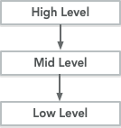
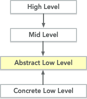

### S - Single Responsibility

> *A class should have one, and only one reason to change - Robert C Martin*
> 

«У класса имеются обязанности, удовлетворяющие его назначению». SRP не требует, чтобы класс совершал лишь одно узконаправленное действие или изменялся лишь по одной вполне конкретной причине, напротив, SRP требует, чтобы класс имел сильное сцепление, чтобы все, чем он занимается, было сильно связано с его назначением.

Задавай вопрос “каково назначение этого класса” - если появляется “и”, то рассмотри его разделение на несколько компонентов

### O - Open Closed

> *software entities (classes, modules, functions, etc.) should be open for extension but closed for modification*
> 

### L - **Liskov Substitution Principle**

> *if S is a subtype of T, then objects of type T may be replaced with objects of type S*
> 

Под *replaced* подразумевается, что заменяемые классы реализуют такое-же **поведение** и вызывающая их программа не сможет их отличить. Методы этих заменяемых классов должны иметь следующие характеристики:

1. У них должно быть одно имя (чтобы реализовывать интерфейс)
2. Они должны принимать те же аргументы и в таком же порядке
3. Они должны возвращать результат того-же типа

<aside>
💡 Интерфейс должен быть тот же, но реализация этих методов может меняться в зависимости от класса

</aside>

### I - **Interface Segregation Principle**

> *Clients should not be forced to depend upon interfaces that they don't use. - Robert C. Martin*
> 

Принцип ISP говорит, что лучше иметь много узкоспециализированных интерфейсов чем один широкого спектра.

ISP более применим для статических языков где есть понятие интерфейса. В Ruby этот принцип можно трактовать следующим образом:

1. При применении наследования, все методы класса предка нужны потомкам
2. При применении модулей, делай их узконаправленными на определённое поведение (swimmable, flyable)

### D - **Dependency Inversion Principle**

> *A high-level module should not depend on a low-level module; both should depend on abstraction.*
> 

> *Abstractions should not depend on details. Details should depend on abstractions.*
> 

> *Depend on abstractions, not concretions.*
> 

Чтобы верхнеуровневые модули не зависели от низкоуровневых мы создаём слой абстракции (от которых зависят вехние уровни). В свою очередь низкоуровненые классы будут реализовывать (зависеть) абстрактные и это поменяем направление зависимости.

Было



Стало



Прикол Ruby в том что тут нет явных абстрактных классов - любой класс можно сделать абстрактным

```ruby
# абстрактный класс в ruby

class AbstractLowLevel
  def foo
    raise NotImplementedError, "Subclasses must implement the 'foo' method."
  end

  def bar
    raise NotImplementedError, "Subclasses must implement the 'bar' method."
  end
end
```

Абстрактного класса может не быть вообще с использованием ducktyping

***Пример***

Было:

```ruby
# Reporter зависит от User т.к. знает его имя, метод и параметры

class Reporter
	def report
		user = User.new('Ivan')
		p user.name
	end
end

class User
	attr_accessor :name
	
	def initialize(name)
		@name = name
	end
end
```

Стало:

```ruby
# класса обределяющего to_str нет, это просто интерфейс в нашей голове
# класс верхнего уровня который раньше зависел от Post и Comment 
# теперь зависит от определённого нами интерфейса (to_str)

class Reporter
	attr_accessor :subject
	
	def initialize(subject)
		@subject = subject
	end

	def report
		p subject.to_str
	end
end

class User
 # ...

  def to_str
    name
  end
end

class Post
  # ...

  def to_str
    title
  end
end

user = User.new(name: "Ivan", age: 18)
post = Post.new(title: "Dependency Injections", body: "...")
Reporter.new(user).report
Reporter.new(post).report
```
