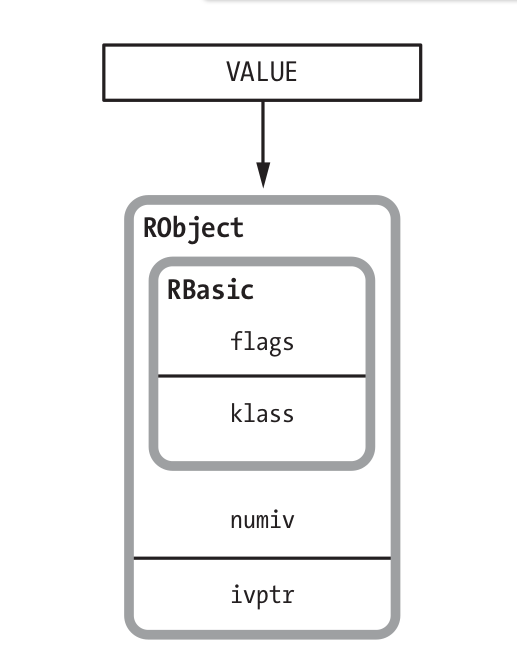
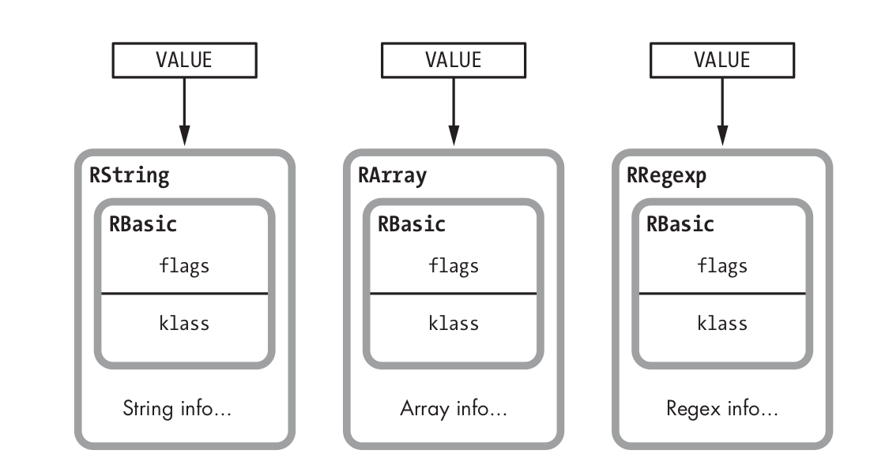
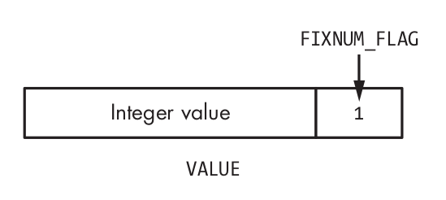
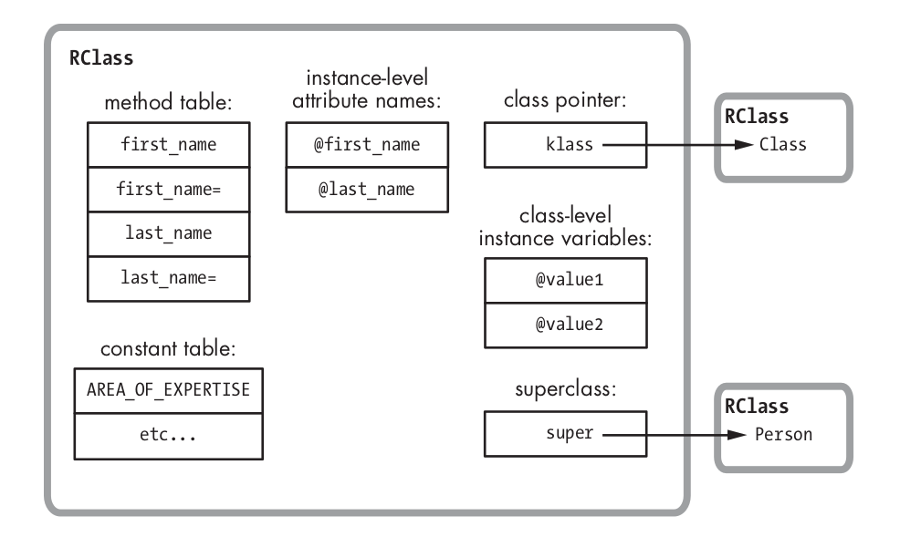
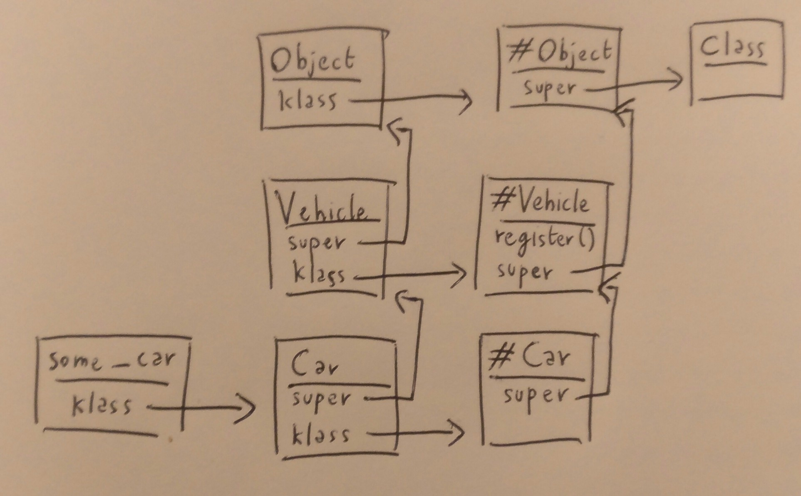

# Object

Объект - сущность содержащая указатель на свой класс (klass) и таблицу значений переменных экземпляра (имена хранятся в классе). 



Value - указатель на объект

flags - набор внутренних технических значений

klass - указатель на класс объекта

numiv - кол-во переменных экземпляра

ivptr - указатель на массив со значениями переменных экземпляра. До Ruby 1.9 тут хранился хэш с именем и значением для каждой переменной. После 1.9 это просто массив начений, имена переменных хранятся в классе объекта

# Generic objects

Ruby использует специальные структуры для строк, массивов и.т.д - RString, RArray …



Для small integers, symbols и еще нескольких типов структура вообще не используется - всё хранится прямо в указателе VALUE

Вместо указателя класса мы использует код флага чтобы полять что это fixnum



# Class

Класс - это обьект, который также хранит таблицу методов (для экземпляров), таблицу имён переменных экземпляра, таблицу констант, укaзатель klass, указатель super и таблицу class level переменных экземпляра.



`klass` - указывает на класс эклемпляром которого является текущий класс (для поиска методов класса). Базовый класс для классов - Class

`super` - указывает на класс предок (для поиска методов экземпляра). Базовый класс предок - Object.


klass(синие стрелки), super(красные)

## Поиск методов экземпляра

1. Иди по указателю klass и посмотри в классе объекта
2. Если пусто иди по указателю super и посмотри в классе предке
3. Повторяй п.2 пока не найдешь метод (иди вплоть до object) иначе undefined_method error.

# Class methods

При создании класса Ruby создаёт 2 класса второй - это метакласс для будущих переменных и методов класса и ставит указатель klass на этот метакласс


## Поиск методов класса

Идентичен алгоритму выше - идём в класс объекта (для класса это будет синглтон класс). 
Cледуем по цепочке super для синглтон классов пока не дойдём до #Object, оттуда в Class т.к. он класс любого класса.
***ВАЖНО!!!*** - после того как дойдём до Class мы продолжаем идти по цепочке super (не указано на картинке) -> Module -> Object -> BaseObject



# Helpers

```ruby
#вывести все публичные методы доступные объекту по цепочке наследования
user.methods 

#вывести все инстанс методы
User.instance_methods
User.instance_methods(false) #исключить методы родителей

#посмотреть цепочку наследования
Class_name.ancestors
```


