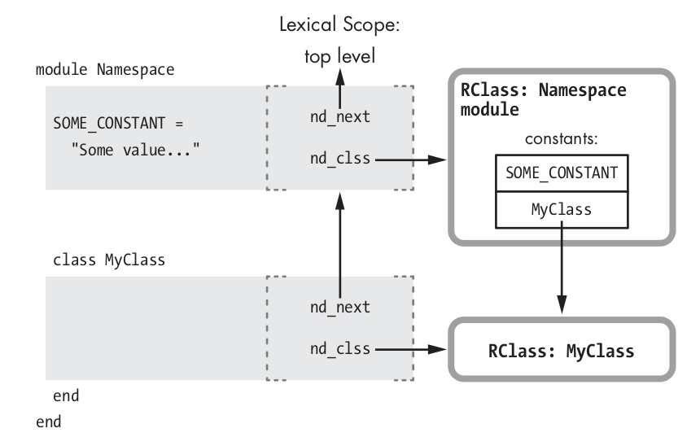

# Lexical scopes

Нужен для поиска констант. Верхнеуровневый scope - default scope. При создании класса или модуля Ruby создаёт новое лексическое окружение и добавляет в родительский lexical scope константу указатель на новый класс/модуль.

`nd_next` - указатель на scope уровнем выше
`nd_clss` - указатель на scope для текущего класса-модуля

## Constants lookup algorithm

1. Ищи в скоупе для текущего класса по nd_clss
2. Если нет, то иди по nd_next и ищи на уровне выше
3. Повтори пока не дойдешь до top level, если не нашел иди по super (от исходного класса) и повтори с п1
4. Иначе - const_missing
