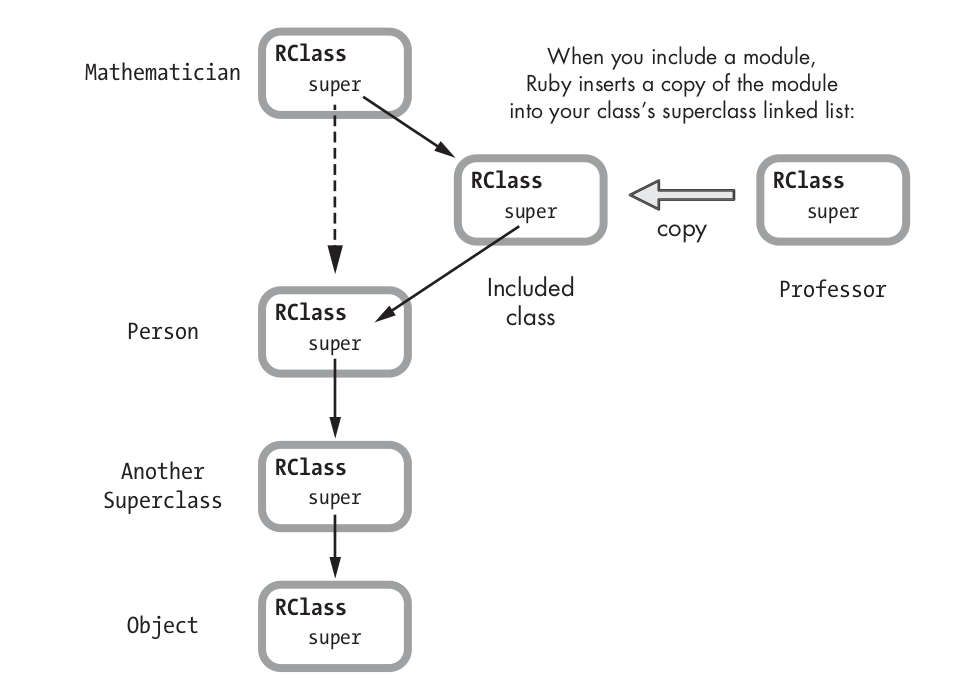
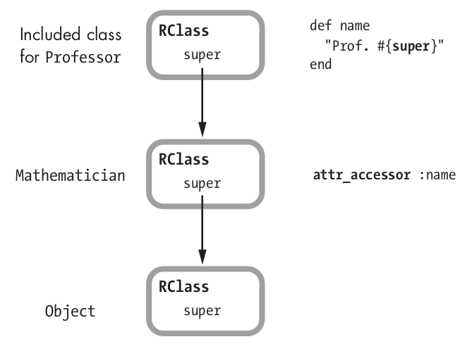
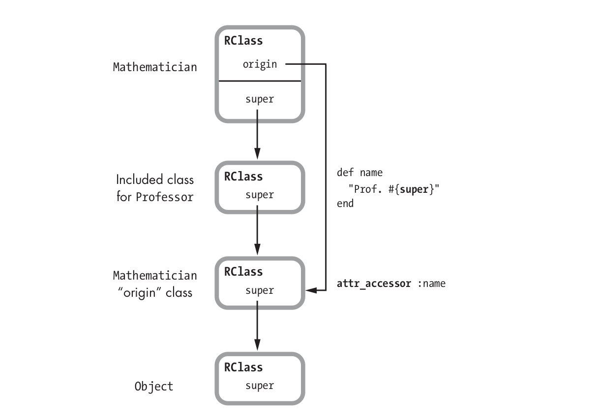

# Modules

В ruby модуль это тоже класс, но ведёт себя немного иначе:
1. Модуль не может иметь суперкласс 
2. Нельзя создать экземпляр модуля
3. Класс может включать много модулей, но наследовать только один класс

## Подключение модуля в класс

### Includes

При кодключении модуля с include, Ruby создаёт копию класса модуля и меняет указатель super на модулью

Создание копии модуля происходит т.к много классов могут включать один модуль (чтобы избежать конфликтов с super)

```ruby
class Mathematician < Person
	include Professor
end

ivan = Mathematician.new
ivan.proffessor_method
```



### Extend

При подключении с помощью `extends`, Ruby подставляет included class вместо того, на который указывает klass. Так все методы модуля становятся доступны как методы класса.

### Prepend

При подключении с помощью pretend, Ruby  будет сначала искать методы экземпляра в модуле и только после этого в классе объекта.



Для того чтобы объект всё еще был экземпляром своего класса (мы же вызываем mathematician.name) Ruby подключает модуль как `include` но чтобы `prepend` работал делает:
1. Копирует Mathematician класс и помещает эту копию как суперкласс модуля (origin class) на схеме. 
2. Чтобы сначала вызывались методы Professor, а не Mathematician перемещает все методы Mathematician в origin class


